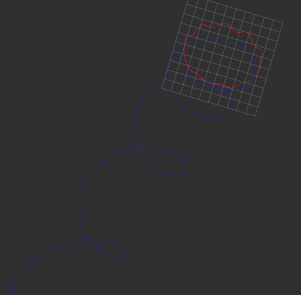
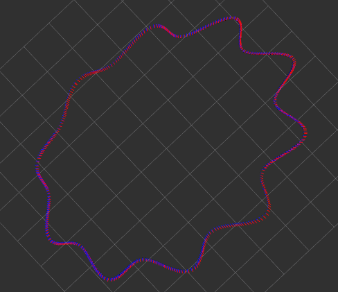
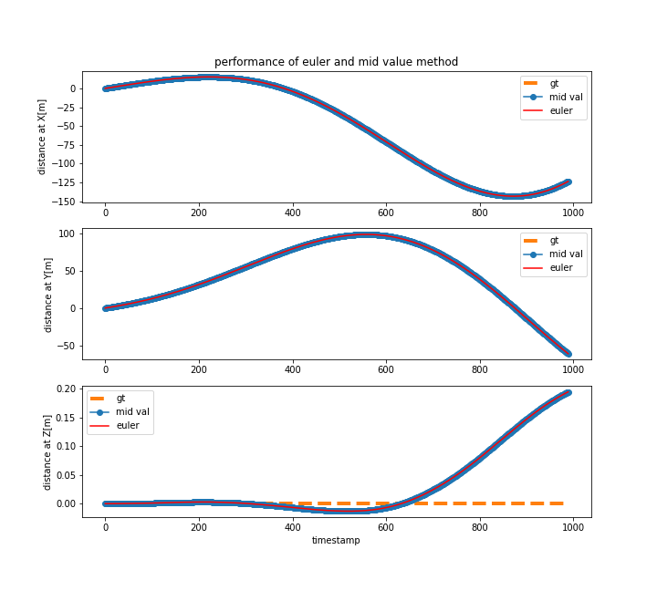

## Performance of Euler method

## Performance of Mid value Method

## Evaulation

From the previous observation, we could see that the performance of mid value method is much better than the euler method **when the object keeps changing direction and moving.**

Hence, some other evaluations have also been done.

### Status: v_x_init=10, v_y_init =10, moving with yaw angle 30

performance: two methods are almost the same performance

****

