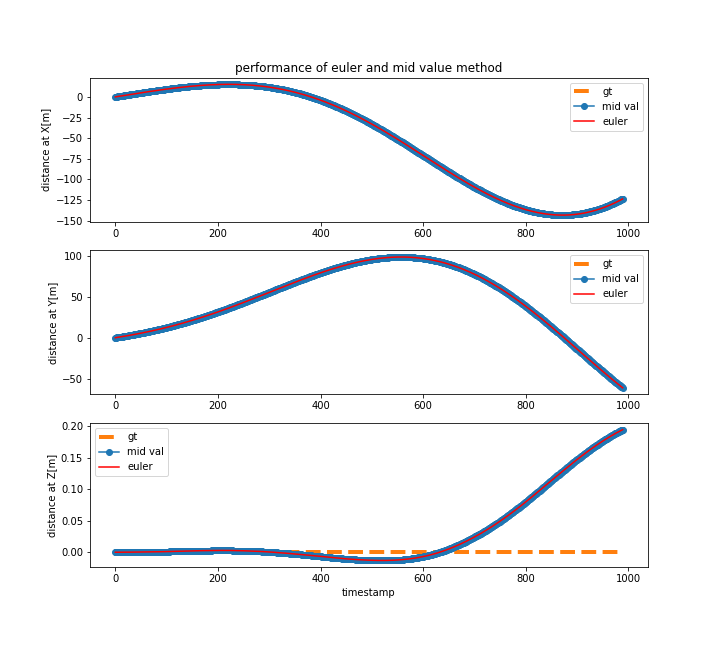
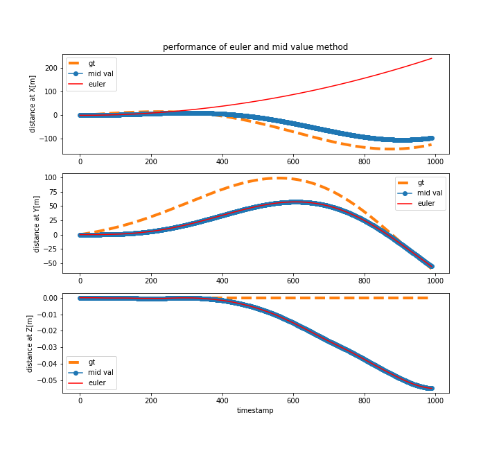
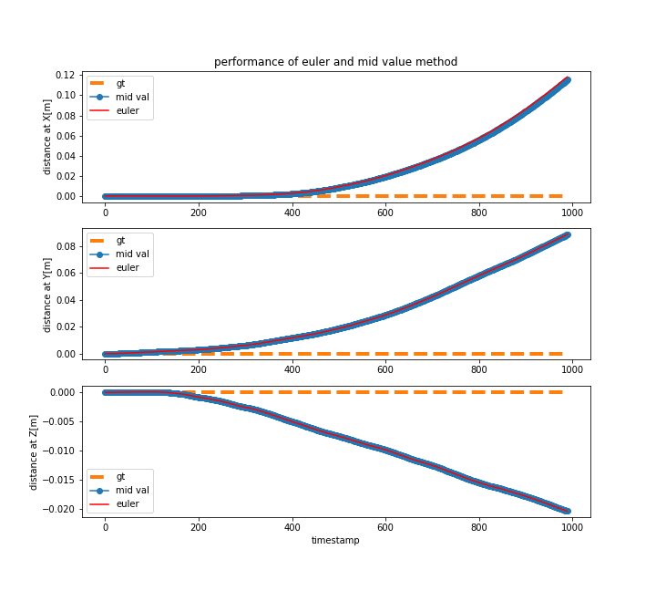
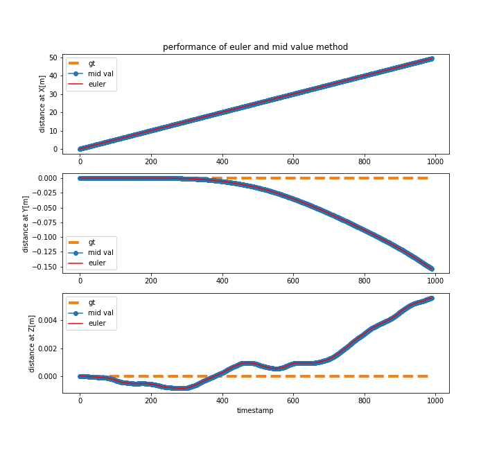

## Performance of Euler method

## Performance of Mid value Method

## Evaulation

From the previous observation, we could see that the performance of mid value method is much better than the euler method **when the object keeps changing direction and moving.**

Hence, some other evaluations have also been done.

### Status: v_x_init=10, v_y_init =10, moving with yaw angle 30

performance: two methods are almost the same performance

### Status: v_x_accel=5,yaw =30, moving with yaw angle 30

From the observation, the performance of mid value method seems to be better in x direction,

### Status: complete still

From the observation, both have bias but the performance is almost the same.

### Status: stable velocity 5 in x axis

From the observation, the two methods has exact estimation in x axis, but the bias in y,z still exists.

## Conclusion:

The performance of mid value method seems to be better when the object changes direction during moving. Otherwise, two methods show similar performance. Also, some bais is always shown, the reason is still not clear.
