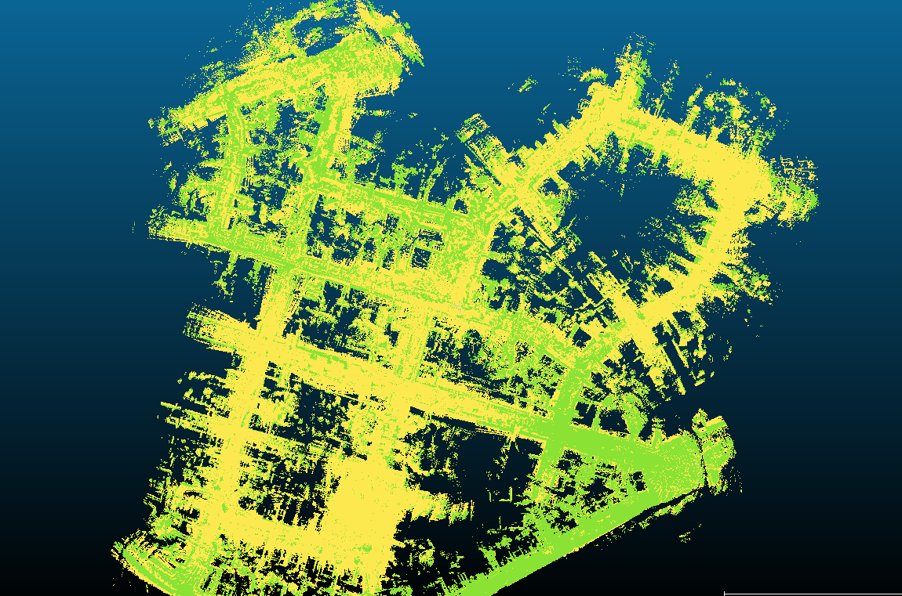

The report is divided into pratical part and theotrical part.

# Pratical Part

## Task 1:

The codeblocks are filled in. The green line shows the optimized tragectory.

First, the wrong map from the previous version was shown for comparison.

Benchmark of the optimized tragectory with imu.

max	6.798616
mean	1.220208
median	0.873224
min	0.118435
rmse	1.601749
sse	4892.595922
std	1.037637

Benchmark of the lidar odometry with imu.

max	34.013475
mean	15.327241
median	15.077945
min	0.000001
rmse	17.886259
sse	610084.133610
std	9.219216

Obviously, it was **wrong**.

after fixing the bugs, the map is obviously clearer.

From the observation, we could see that the tragectory is smoother, and the map is more clear.

The corresponding analysis is following.

max      0.714922
mean      0.119683
median      0.102119
min      0.005584
rmse      0.144256
sse      39.809408
std      0.080536

## Task 2

After disabling the usage of IMU, the result has also been obviously improved after optimization.  But the perfromance is worse than the one with IMU as expected.

optimized benchmark

max	1.375001
mean	0.358914
median	0.332925
min	0.023321
rmse	0.413774
sse	327.693883
std	0.205887

lidar benchmark

max	21.144567
mean	10.719335
median	11.076510
min	0.000001
rmse	12.006945
sse	275935.116542
std	5.409490

 

The comparization of the optimized map with IMU and without IMU is done below.

The green one represents the one with IMU. The green one seems to be obviously more concrete and clear.

After taking a close look, the performance with IMU in the z direstion is also better in general. But in some part(like at the right side), the perforamance with IMU seems to have more noise in the z direction.

# Theoretical Part

 

