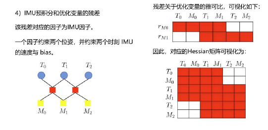
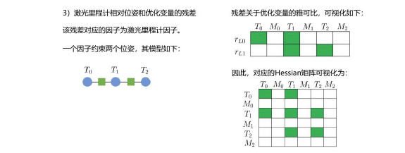

Theory

要解决本章内容

1.求得IMU preintegration，Map Matching，relative pose from lidar 的因子和优化变量的残差

In the directory  **src/lidar_localization/include/lidar_localization**

推导细节见doc文档，修改代码对应文件目录
│   └── sliding_window
│       ├── factors
│       │   ├── factor_prvag_imu_pre_integration.hpp
│       │   ├── factor_prvag_map_matching_pose.hpp
│       │   ├── factor_prvag_marginalization.hpp
│       │   └── factor_prvag_relative_pose.hpp

2. Sliding Window Marginalization

分两步移除old frame，修改的文件为factor_prvag_marginalization.hpp

3. 在sliding_window.cpp中我们添加约束
4. 在ceres_sliding_window.cpp中我们添加响应因子和parameter block

Code Structure

In directory  **src/lidar_localization/src/models**

├── cloud_filter
├── graph_optimizer
│   ├── g2o
├── kalman_filter
├── mag_table
│   └── geo_mag_declination.cpp
├── pre_integrator
│   ├── imu_pre_integrator.cpp
│   └── odo_pre_integrator.cpp
├── registration
│   └── ndt_registration.cpp
├── scan_adjust
│   └── distortion_adjust.cpp
├── scan_context_manager
│   ├── key_frames.pb.cpp
│   ├── ring_keys.pb.cpp
│   ├── scan_context_manager.cpp
│   └── scan_contexts.pb.cpp
└── sliding_window
└── ceres_sliding_window.cpp

In the directory  **src/lidar_localization/include/lidar_localization**

├── data_pretreat
├── global_defination
├── matching
│   ├── back_end
│   │   ├── sliding_window_flow.hpp
│   │   └── sliding_window.hpp
│   └── front_end
│       ├── matching_flow.hpp
│       └── matching.hpp
├── models
│   ├── cloud_filter
│   │   ├── box_filter.hpp
│   ├── graph_optimizer
│   │   ├── g2o
│   │   │   ├── edge
│   │   │   │   ├── edge_prvag_imu_pre_integration.hpp
│   │   │   │   ├── edge_prvag_odo_pre_integration.hpp
│   │   │   │   ├── edge_prvag_prior_pos.hpp
│   │   │   │   ├── edge_prvag_relative_pose.hpp
│   │   │   │   ├── edge_se3_priorquat.hpp
│   │   │   │   └── edge_se3_priorxyz.hpp
│   │   │   ├── g2o_graph_optimizer.hpp
│   │   │   └── vertex
│   │   │       └── vertex_prvag.hpp
│   │   └── interface_graph_optimizer.hpp
│   ├── kalman_filter
│   ├── mag_table
│   │   └── geo_mag_declination.hpp
│   ├── pre_integrator
│   │   ├── imu_pre_integrator.hpp
│   │   ├── odo_pre_integrator.hpp
│   │   └── pre_integrator.hpp
│   ├── registration
│   ├── scan_adjust
│   ├── scan_context_manager
│   └── sliding_window
│       ├── ceres_sliding_window.hpp
│       ├── factors
│       │   ├── factor_prvag_imu_pre_integration.hpp
│       │   ├── factor_prvag_map_matching_pose.hpp
│       │   ├── factor_prvag_marginalization.hpp
│       │   └── factor_prvag_relative_pose.hpp
│       ├── params
│       │   └── param_prvag.hpp
│       └── utils
├── publisher
├── sensor_data
├── subscriber
├── tf_listener
└── tools

## Experiment

| window size | 5 | 10 | 20 | 40 | X |
| - | - | - | - | - | - |
| Improvement | 0.54 | 0.28 | 0.65 | 0.449 / 0.37 |   |

Conclusion: The experiment data is shown above, incresing the window size would increase the working load and time of the computer, but could not improve efficiency sometimes.

The table shows best performance appears when the window size is 20, and from opinion, window size 5 provides a enough good output.

### Sliding Window Size vs Performance

slide window size 40:

Lidar Odom:

max      3.767447
mean      1.803930
median      1.851701
min      0.000001
rmse      1.956166
sse      17326.787012
std      0.756587

Optimized:

max      3.755586
mean      1.354122
median      1.285346
min      0.000001
rmse      1.544220
sse      10797.539279
std      0.742273

slide window size 20:

Lidar Odom:

max      3.767447
mean      1.803930
median      1.851701
min      0.000001
rmse      1.956166
sse      17326.787012
std      0.756587

Optimized:

max      3.767447
mean      1.150426
median      1.114598
min      0.000001
rmse      1.309444
sse      7763.906568
std      0.625430

Window Length: 40

Lidar Odom

max      4.003096
mean      1.935797
median      1.987574
min      0.000001
rmse      2.099044
sse      19954.702430
std      0.811588

Optimized Odom

max      4.027566
mean      1.569013
median      1.543497
min      0.000001
rmse      1.738434
sse      13687.325908
std      0.748565

Window Length: 10

Lidar Odom

max      3.414863
mean      1.599265
median      1.642315
min      0.000001
rmse      1.733028
sse      13596.322588
std      0.667634

optimized

max      3.402521
mean      1.319541
median      1.305639
min      0.000001
rmse      1.459341
sse      9641.038050
std      0.623287

WIndow Length: 5

Lidar Odom

max      3.414863
mean      1.599265
median      1.642315
min      0.000001
rmse      1.733028
sse      13596.322588
std      0.667634

optimized

max      3.421523
mean      1.057977
median      0.959164
min      0.000001
rmse      1.201034
sse      6530.118192
std      0.568478

From the observation, the mean error is smller by 0.6 after optimization.

### Compared with EKF

Compared with the ESKF performance in the charpter 8, the optimization-based method gives a more obvious improvement.
