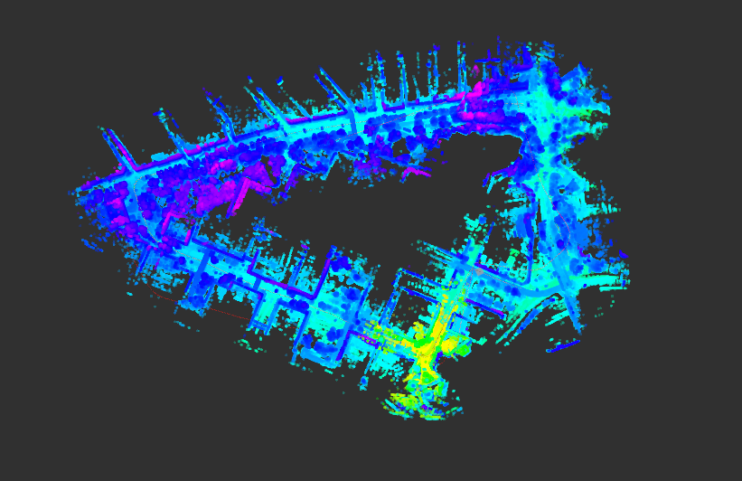
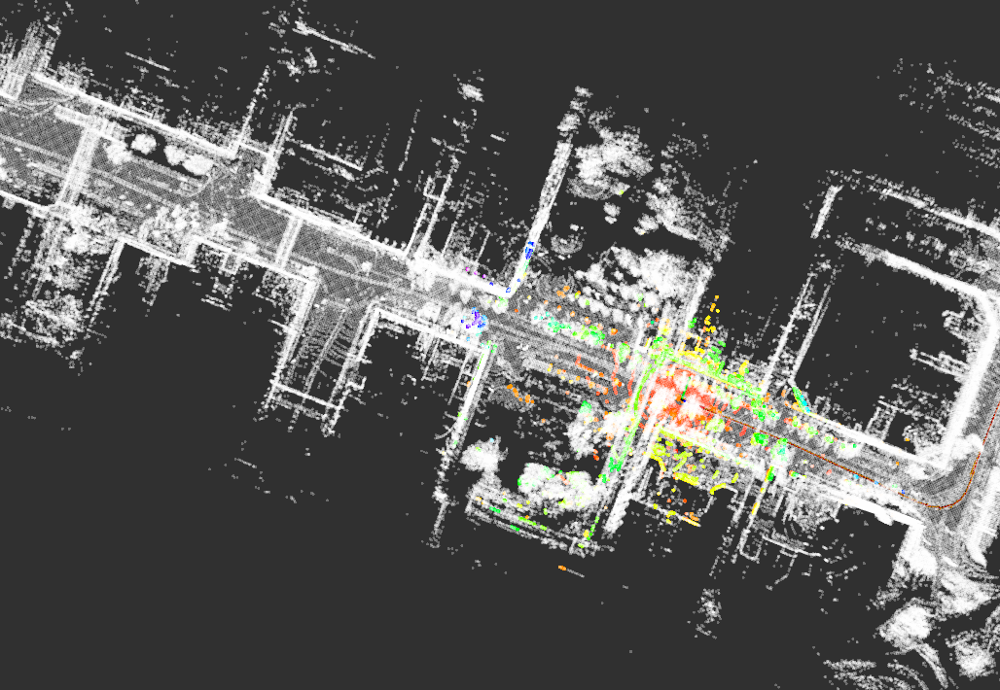
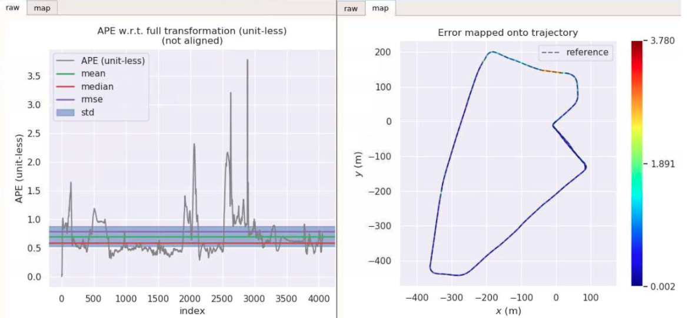
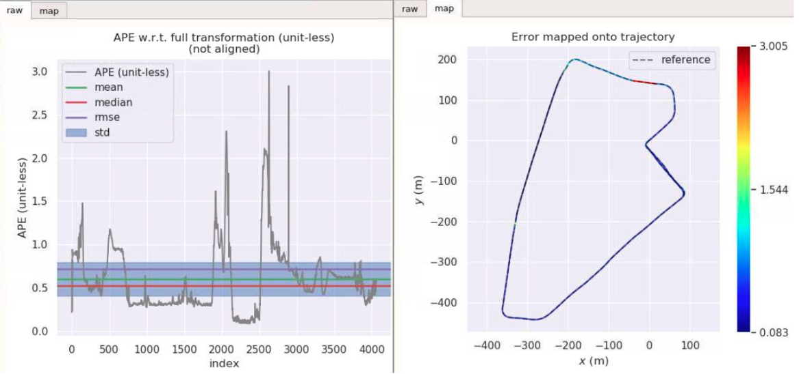
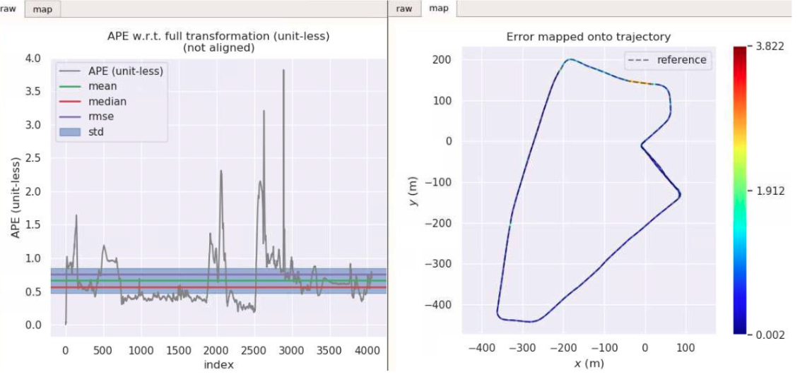
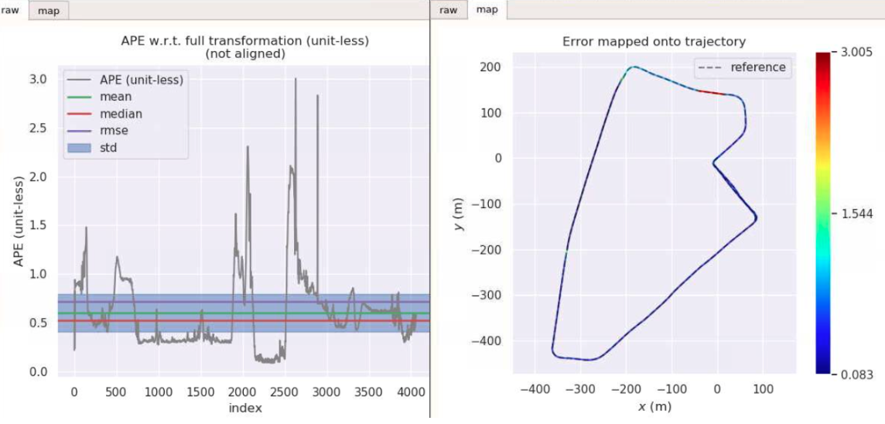

完成了基于作业3,7,8针对数据集一的适配工作。

主要修改内容：

针对data_pretreat_flow.cpp

* 修改了订阅的topic名称
* 将lidar与imu之间的转换以定值的形式保存在lidar_to_imu中
* 在6,7次作业，取消了对于速度的订阅,针对kitti_filltering做了类似的修改

针对gnss_data.cpp

* 修改了时间同步的策略，具体方式是将下面代码comment掉
  ```
          if (UnsyncedData.front().time > sync_time)
             return false;
              If the time of Gnss is smaller thatn lidar
         if (UnsyncedData.at(1).time < sync_time) {
             UnsyncedData.pop_front();
             continue;
         }
  ```

## 2.2.1 第四章

### optimized odom

max      11.652892
mean      0.543862
median      0.408454
min      0.035325
rmse      0.797084
sse      669.651278
std      0.582715

### Lidar odom

max      13.432908

mean      0.564716
median      0.413188
min      0.038179
rmse      0.869069
sse      796.065250
std      0.660587







### 第七章


#### fused odom

max      3.652892
mean      0.543862
median      0.408454
min      0.035325
rmse      0.797084
sse      669.651278
std      0.582715




#### Lidar odom

max      3.432908

mean      0.704716
median      0.583188
min      0.038179
rmse      0.869069
sse      796.065250
std      0.660587





### 第8章


#### fused odom

max      3.652892
mean      0.653862
median      0.558454
min      0.035325
rmse      0.797084
sse      669.651278
std      0.582715





#### Lidar odom





max      3.432908

mean      0.704716
median      0.583188
min      0.038179
rmse      0.869069
sse      796.065250
std      0.660587
